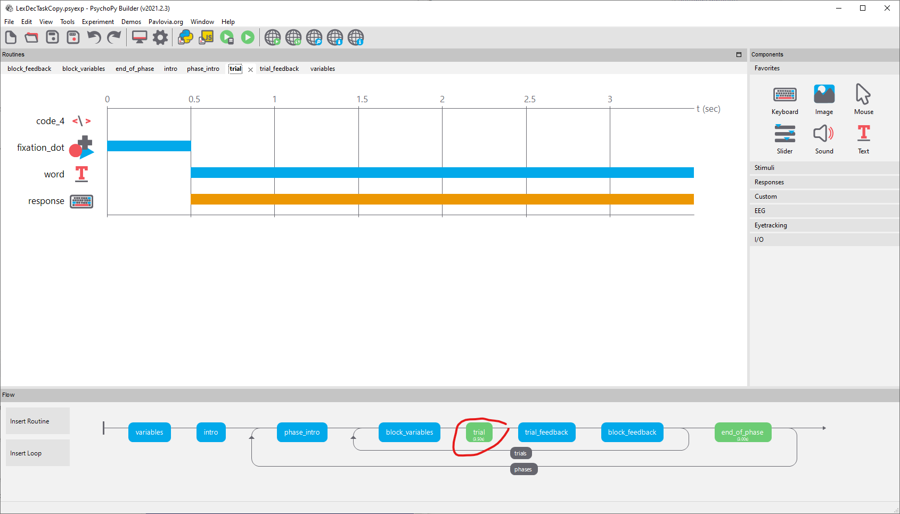
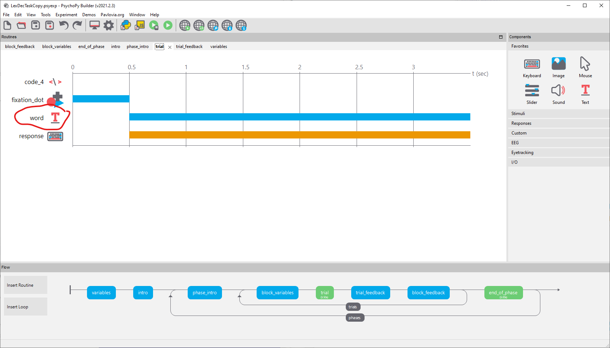
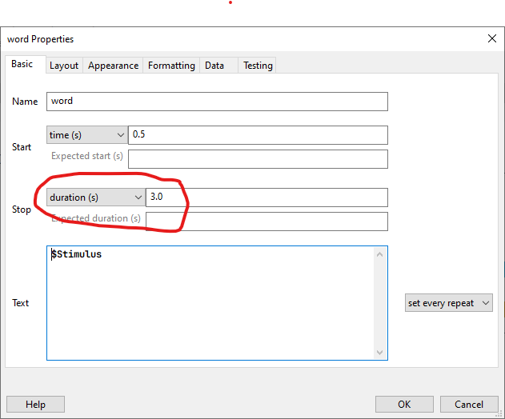
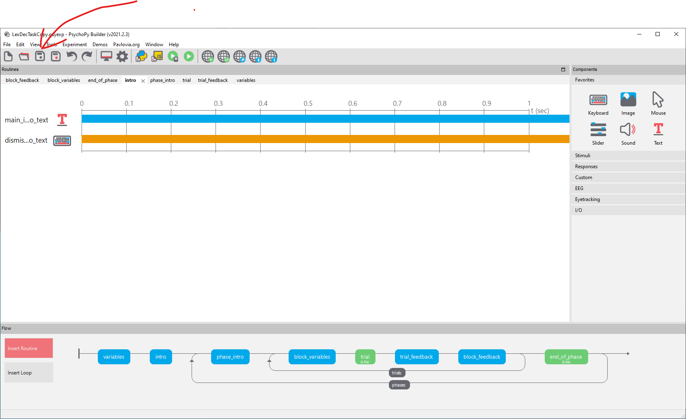
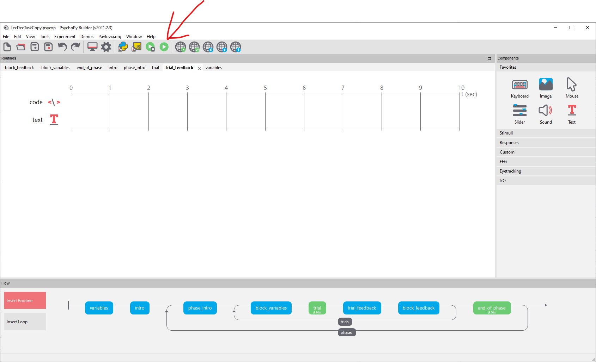

# Stimulus duration {#stimdur}

::: {.rmdnote}
Increase the stimulus duration from 3 to 5 seconds.
:::

## Change the stimulus duration

The routine that contains the stimulus is `trial`. 

{width="100%"}

Click on `trial`. 

See the TextBox called `word`. 

{width="100%"}

Click on `word` to bring up its properties.

{width="100%"}

See that `duration` is set to `3.0` seconds.
 
To change the duration to 5 seconds, replace `3.0` with `5.0`

## Save the experiment

Save the experiment.

{width="100%"}

## Run the experiment

Run the experiment to see whether your changes worked.

You can press `escape` after a few trials if you don't need to run the whole experiment.

{width="100%"}
