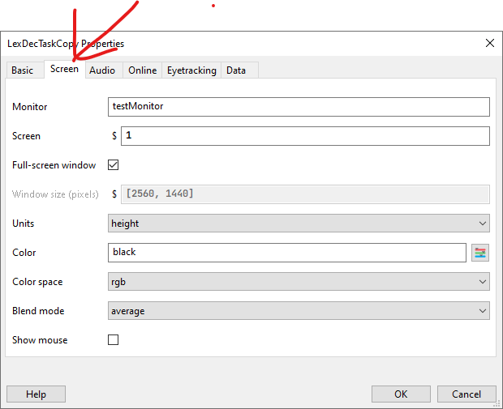
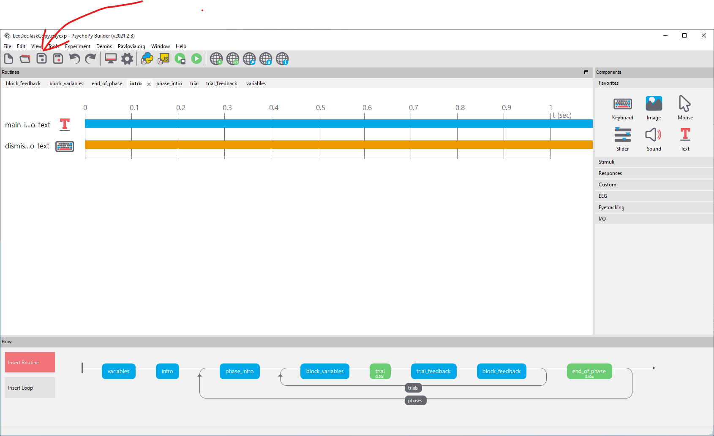
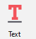

# Colours

::: {.rmdnote}
Change the screen colour to white, and the text colour to black, throughout the experiment.
:::

There are two things you need to do to accomplish this.

## Change the screen colour to white 

By default, PsychoPy uses a grey background. In the Lexical Decision Task we used a black background. You can access the screen colour property from the cog wheel symbol:

{width="100%"}

{width="100%"}

then the `Screen` tab's `Color` property:

{width="100%"}

{width="100%"}

Now that you have chosen white as the background, you need to save the experiment using the conventional save button:

{width="100%"}

## Change the text colour to black

By default, Psychopy uses white text against a grey background. Now that you have changed the screen colour to white, all the text that is white in colour will be invisible. So you need to change the text colour to black. There isn't an experiment-wide place to change the colour of text: text colour is a property of each individual text component.

A text component looks like a red T:

{width="25%"}

You need to go through each of the routines to find where the text boxes are: here we click on the `intro` routine in the `Flow` pane at the bottom of the interface, and its text box:

{width="100%"}

{width="100%"}

The `Appearance`tab is where you can specify properties of this particular text box; and one of those properties is its`Foreground Color`

{width="100%"}

You need to go through all the routines looking for text boxes that currently display white text, and change them to display black text.

## Save the experiment

Save the experiment.

{width="100%"}

## Run the experiment

Run the experiment to see whether your changes worked.

You can press `escape` after a few trials if you don't need to run the whole experiment.

{width="100%"}
