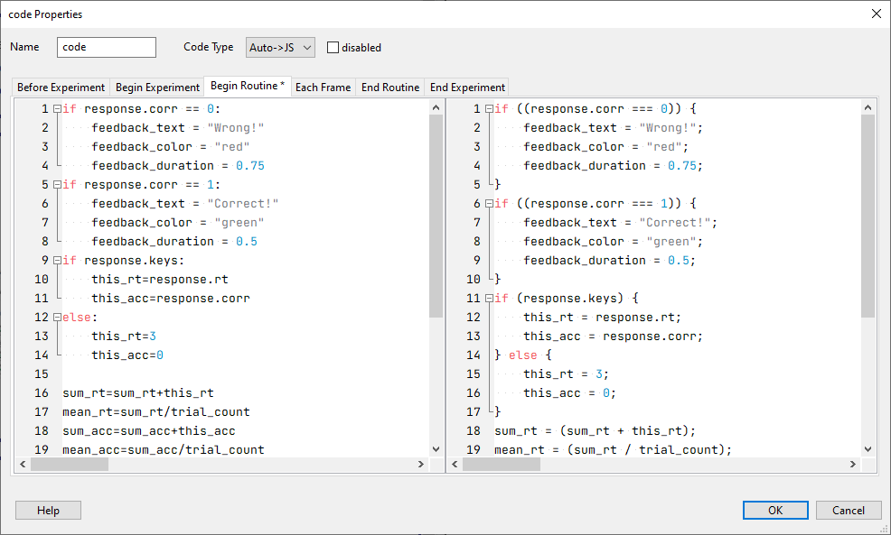
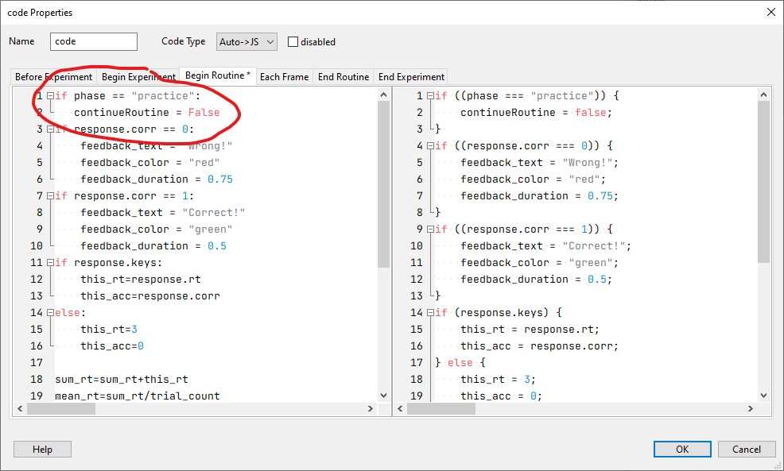

# Feedback

Turn off feedback in the experimental (but not the practice) block.

The routine that contains the feedback is `trial_feedback`. Click on `trial_feedback`.

See the `code` component. Click on it.

{width="100%"}

Put your cursor in the first line of the left hand side.

Type:

```{r, eval=FALSE, echo=TRUE}
if phase == "practice":
   continueRoutine = False
```

So that the `code` component looks like this:

{width="100%"}

Save the experiment.