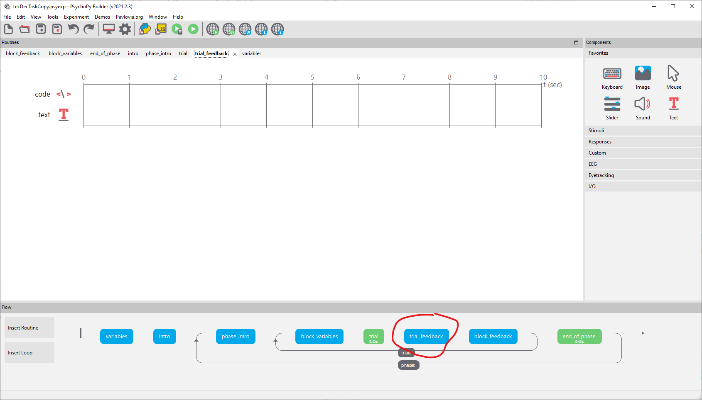
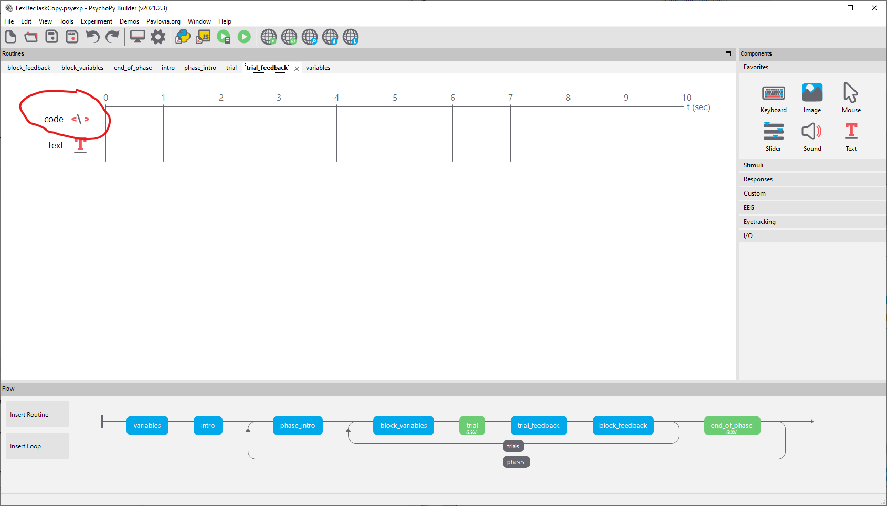
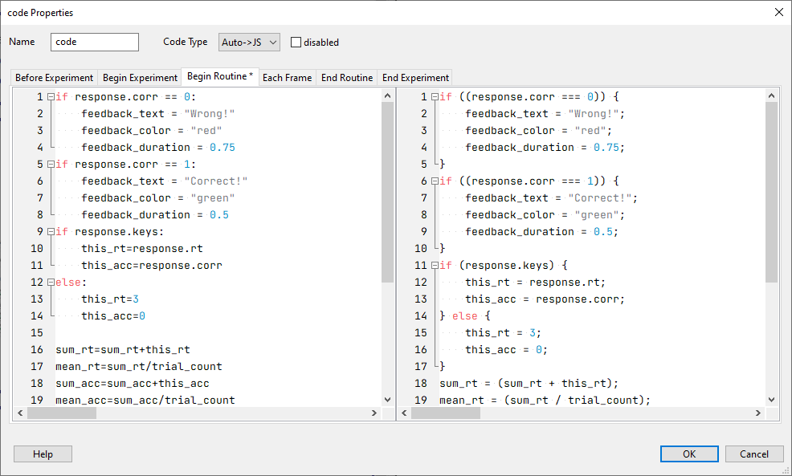
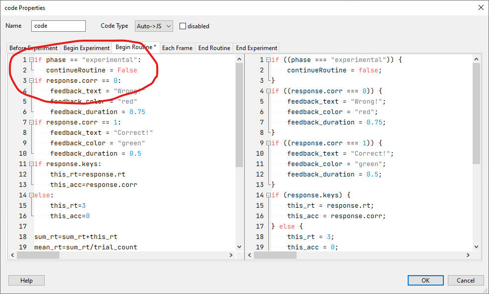

# Feedback

::: {.rmdnote}
Turn off feedback in the experimental (but not the practice) block.
:::

## Turn off feedback

The routine that contains the feedback is `trial_feedback`. 

{width="100%"}

Click on `trial_feedback`.

See the `code` component. 

{width="100%"}

Click on the `code` component..

{width="100%"}

Put your cursor in the first line of the left hand side.

Type:


```r
if phase == "experimental":
   continueRoutine = False
```

So that the `code` component looks like this:

{width="100%"}

## Save the experiment

Save the experiment.

{width="100%"}

## Run the experiment

Run the experiment to see whether your changes worked.

You can press `escape` after a few trials if you don't need to run the whole experiment.

{width="100%"}

